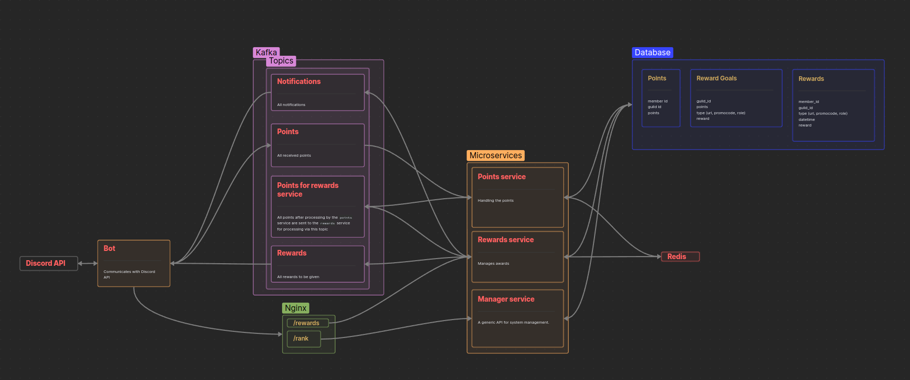

[](https://github.com/AndyLocks/LegoTehSet/blob/master/LICENSE)
[]()
[](https://github.com/discord-jda/JDA)

[](https://discord.com/oauth2/authorize?client_id=1114974604784578590)

# All microservices
[](https://github.com/AndyLocks/rank_system.bot)
[](https://github.com/AndyLocks/rank_system.points_service)
[](https://github.com/AndyLocks/rank_system.rewards_service)
[](https://github.com/AndyLocks/rank_system.manager)

# Rank System
## Description
It's a ranking system for discord servers. It counts points and gives out rewards for messages. The rewards are easily customisable and manageable.
## Rewards
The reward can be a role in discord or a link to other services.

The link could be to a secret youtube video accessible only through a link or a link to a one-time promo code on some service.
It can also be a link to the Rank system API for a cooler reward.

## Structure


---

### [Bot](https://github.com/AndyLocks/rank_system.bot)
It's a bot microservice. It is the main way of communication with the application. It also counts points, gives rewards and sends notifications to a member.

### [Points service](https://github.com/AndyLocks/rank_system.points_service)
Processes all the points that the bot sends.

### [Rewards service](https://github.com/AndyLocks/rank_system.rewards_service)
Processes the points and decides what awards will be given out. Also sends a notification to the bot.

### [Manager](https://github.com/AndyLocks/rank_system.manager)
This is the main api for managing the service.

### Kafka

#### Notifications
These are all the notifications to be sent by the bot. Users receive notifications directly into a private chat with the bot.

#### Points
Points earned by users that need to be processed.

#### Points for rewards service
This topic is for points consumption by `rewards service`.

`points service` puts the same points into the `points_for_rewards` topic after successful processing.

#### Rewards
All rewards to be given to users.

## Commands
`/goals` - Show a list of awards


---

`/delete_reward_goal` - Delete a reward goal by id
> `id` - reward goal id


---

`/new_role_goal` - Create a new award

> `role` - a discord role
> 
> `points` - points for which you can get a role


---

`\rank` - Show a list of points


---

`\new_url_goal` - Create a new award
> `url` - Link as a reward. It can be a YouTube video accessible only by link or an invitation to a secret discord server.
> 
> `points` - points for which you can get a link


## Docker compose etaps


---

## Invite the bot
[Invite](https://discord.com/oauth2/authorize?client_id=1114974604784578590)

## Build and run
### Clone this repository
```shell
git clone https://github/AndyLocks/RankSystem
```

### Configuration
1. Rename `./bot/.env.example` to `./bot/.env`
2. Write a discord bot token in the `TOKEN` column

   Example: `TOKEN=asSkDSfjwDebt.AbobAkdkjdOnbwdslkfjwelkhfgnkoAJSsdDasdWdHKPjsdkfhn.LKDSJlksdflkjDFlksdjf`

### Install docker and docker compose
Here you can read how to install [Docker compose](https://docs.docker.com/compose/install/).

Here you can read how to install [Docker engine](https://docs.docker.com/engine/install/).

### Run project
```bash
docker compose up --build
```
