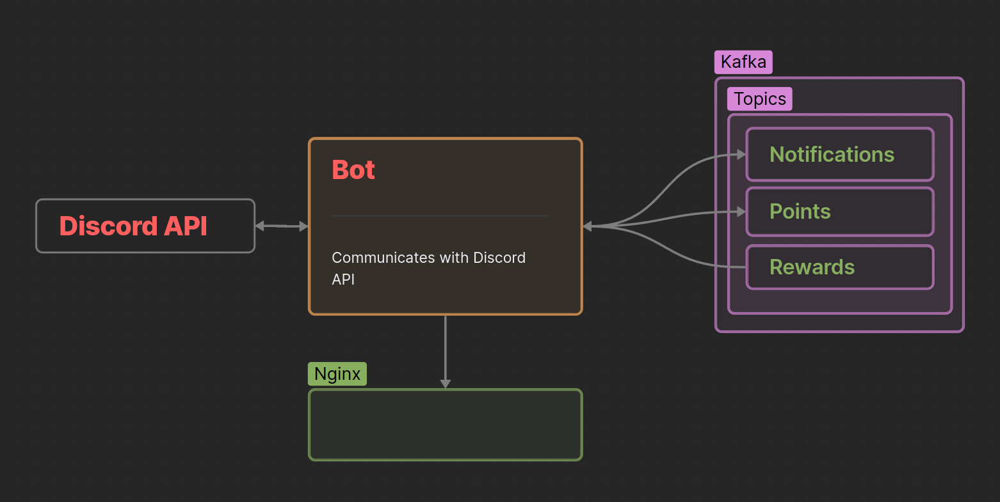

# Main repo

# All microservices

---

**This project is part of [another project.](https://github.com/AndyLocks/RankSystem)**
# Rank system bot
## Description
It's a bot microservice. It is the main way of communication with the application. It also counts points, gives rewards and sends notifications.
## Commands

`/goals` - Show a list of awards

`/delete_reward_goal` - Delete a reward goal by id
> `id` - reward goal id

`/new_role_goal` - Create a new award
> `role` - a discord role
> 
> `points` - points for which you can get a role

`\rank` - Show a list of points

`\new_url_goal` - Create a new award
> `url` - Link as a reward. It can be a YouTube video accessible only by link or an invitation to a secret discord server.
> 
> `points` - points for which you can get a link

---

