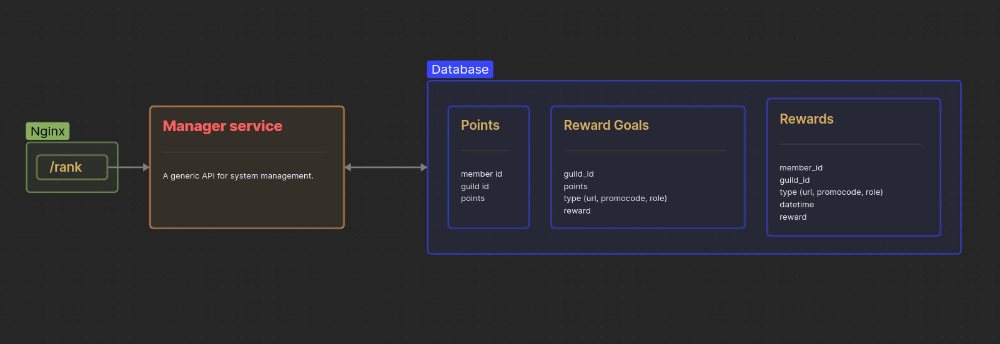

# Main repo

# All microservices

---

**This project is part of [another project.](https://github.com/AndyLocks/RankSystem)**

# Manager Service
## Description
This is the main api for managing the service.

---

